# Dynamic Context Trigger Flow Diagrams

## Overview
This document illustrates the various flow patterns for the Dynamic Context Trigger system, showing how triggers can automate workflows across the entire development lifecycle.

## Core Trigger Flow

## Expanded Trigger Actions

## Development Workflow Automation

### JIRA Status Change Flow

### Email Thread Automation

### Git Repository Triggers

## Complex Multi-Stage Triggers

### Cascading Trigger Example

### Parallel Processing Flow

```mermaid
graph TD
    A[Critical JIRA Ticket] -->|High Priority Trigger| B[Parallel Execution]
    
    B --> C[Workspace 1: GPT-4]
    B --> D[Workspace 2: Claude]
    B --> E[Workspace 3: Expert Agent]
    
    C --> F[Solution 1]
    D --> G[Solution 2]
    E --> H[Solution 3]
    
    F --> I[Compare Results]
    G --> I
    H --> I
    
    I --> J[Select Best Solution]
    J --> K[Create Final PR]
```

## Resource Management Flow

## Error Handling & Recovery

## Monitoring & Analytics Flow

## User Interaction Points

## Security & Permissions Flow

## Data Flow Architecture

## Lifecycle Management

