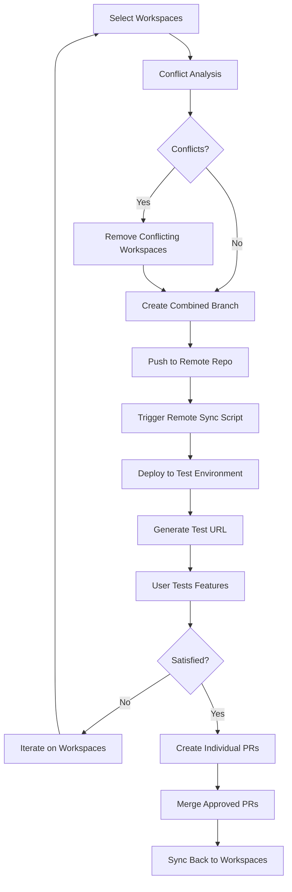
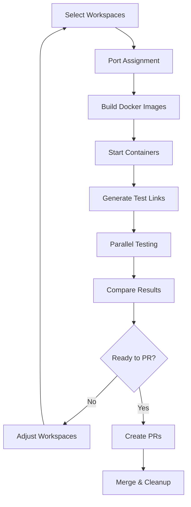

# Parallel Workspace Testing System

## 🎯 Vision

Enable efficient parallel development where multiple workspaces can be tested simultaneously, either on remote deployments or local containerized environments, with intelligent conflict detection and streamlined PR workflows.

## 🏗️ Two Core Testing Scenarios

### Scenario 1: Remote Deployment Testing
**Use Case**: External production-like site with dependencies, databases, services
- Test workspace changes on actual production infrastructure
- Deploy to remote staging/test environments
- Full integration testing with real data and services

### Scenario 2: Local Containerized Testing  
**Use Case**: Self-contained applications like context-pipeline
- Spin up isolated test environments on different ports
- Test multiple feature branches simultaneously
- Quick iteration without external dependencies

## 🔄 Architecture Overview

```
┌─────────────────────────────────────────────────────────────────┐
│                    Workspace Selection Hub                      │
├─────────────────────────────────────────────────────────────────┤
│ [WS1: Trigger Rules] [WS2: Agent Auto] [WS3: UI Polish]        │
│ ☑ Selected          ☑ Selected        ☐ Conflicts             │
│                                                                 │
│ [🚀 Deploy Remote] [🐳 Test Local] [📊 Conflict Analysis]      │
└─────────────────────────────────────────────────────────────────┘
                                │
                ┌───────────────┴───────────────┐
                │                               │
        ┌───────▼────────┐                ┌────▼─────────┐
        │ Remote Testing │                │ Local Testing│
        │                │                │              │
        │ ├─ Deploy      │                │ ├─ Port 3001 │
        │ ├─ Test URL    │                │ ├─ Port 3002 │
        │ ├─ Monitor     │                │ ├─ Port 3003 │
        │ └─ Feedback    │                │ └─ Compare   │
        └───────┬────────┘                └────┬─────────┘
                │                               │
                └───────────────┬───────────────┘
                                │
                        ┌───────▼────────┐
                        │   PR Manager   │
                        │                │
                        │ ├─ Create PRs  │
                        │ ├─ Link Tests  │
                        │ ├─ Merge Back  │
                        │ └─ Sync Deps   │
                        └────────────────┘
```

## 📋 Detailed Workflows

### Remote Deployment Testing Workflow



### Local Containerized Testing Workflow



## 🧠 Intelligent Conflict Detection

### Git Diff Analysis
```typescript
interface ConflictAnalysis {
  workspaces: string[];
  conflicts: {
    workspace_a: string;
    workspace_b: string;
    conflicting_files: string[];
    conflict_type: 'content' | 'structure' | 'dependency';
    severity: 'blocking' | 'warning' | 'minor';
    suggested_resolution: string;
  }[];
  safe_combinations: string[][];
  recommended_action: 'proceed' | 'resolve_conflicts' | 'test_separately';
}
```

### Smart Workspace Grouping
```typescript
// Example conflict detection logic
function analyzeWorkspaceCompatibility(workspaces: Workspace[]): ConflictAnalysis {
  const conflicts = [];
  
  for (let i = 0; i < workspaces.length; i++) {
    for (let j = i + 1; j < workspaces.length; j++) {
      const conflictingFiles = findConflictingFiles(
        workspaces[i].changedFiles,
        workspaces[j].changedFiles
      );
      
      if (conflictingFiles.length > 0) {
        conflicts.push({
          workspace_a: workspaces[i].id,
          workspace_b: workspaces[j].id,
          conflicting_files,
          severity: assessConflictSeverity(conflictingFiles),
          suggested_resolution: generateResolutionSuggestion(conflictingFiles)
        });
      }
    }
  }
  
  return {
    workspaces: workspaces.map(w => w.id),
    conflicts,
    safe_combinations: findSafeCombinations(workspaces, conflicts),
    recommended_action: conflicts.length > 0 ? 'resolve_conflicts' : 'proceed'
  };
}
```

## 🌐 Remote Deployment Integration

### Configuration Structure
```json
{
  "remote_environments": {
    "production_staging": {
      "repo_url": "git@github.com:company/production-site.git",
      "branch_prefix": "workspace-test-",
      "deploy_script": "./scripts/deploy-test.sh",
      "sync_script": "./scripts/sync-from-main.sh", 
      "test_url_pattern": "https://{branch}.staging.company.com",
      "webhook_url": "https://api.staging.company.com/deploy",
      "credentials": {
        "ssh_key": "~/.ssh/staging_deploy_key",
        "api_token_env": "STAGING_API_TOKEN"
      }
    }
  }
}
```

### Remote Sync Script Example
```bash
#!/bin/bash
# scripts/sync-from-main.sh (runs on remote server)

BRANCH_NAME=$1
WORKSPACE_IDS=$2

# Pull latest changes
git fetch origin
git checkout $BRANCH_NAME
git pull origin $BRANCH_NAME

# Deploy to test environment
./deploy/staging-deploy.sh $BRANCH_NAME

# Update status API
curl -X POST "$WEBHOOK_URL/status" \
  -H "Authorization: Bearer $API_TOKEN" \
  -d "{\"branch\":\"$BRANCH_NAME\",\"status\":\"deployed\",\"workspaces\":\"$WORKSPACE_IDS\"}"

echo "Deployment complete. Test URL: https://$BRANCH_NAME.staging.company.com"
```

## 🐳 Local Container Testing

### Docker Compose Template
```yaml
# Generated dynamically for each workspace combination
version: '3.8'
services:
  workspace-test-${WORKSPACE_COMBO_ID}:
    build:
      context: .
      dockerfile: Dockerfile.dev
      args:
        - WORKSPACE_BRANCH=${BRANCH_NAME}
    ports:
      - "${ASSIGNED_PORT}:3000"
    environment:
      - NODE_ENV=development
      - WORKSPACE_ID=${WORKSPACE_COMBO_ID}
      - TEST_MODE=true
    volumes:
      - ./test-data:/app/data
    labels:
      - "workspace.combination=${WORKSPACE_IDS}"
      - "workspace.branch=${BRANCH_NAME}"
```

### Port Management
```typescript
class PortManager {
  private usedPorts = new Set<number>();
  private basePort = 3001;
  
  assignPort(workspaceComboId: string): number {
    let port = this.basePort;
    while (this.usedPorts.has(port)) {
      port++;
    }
    this.usedPorts.add(port);
    return port;
  }
  
  releasePort(port: number): void {
    this.usedPorts.delete(port);
  }
  
  getTestUrl(port: number): string {
    return `http://localhost:${port}`;
  }
}
```

## 🔗 Feature-Based Architecture

Following the established 4-component workspace design and feature-first organization:

### File Structure
```
src/features/
├── workspace-testing/           # "Test Workspaces" feature
│   ├── WorkspaceTestingUI.tsx   # Main testing interface
│   ├── WorkspaceTestingAPI.ts   # API calls for testing
│   ├── WorkspaceTestingLogic.ts # Business logic
│   ├── WorkspaceTestingTypes.ts # TypeScript types
│   ├── components/
│   │   ├── WorkspaceSelector.tsx
│   │   ├── ConflictAnalysisPanel.tsx
│   │   ├── TestingControls.tsx
│   │   └── ActiveTestsPanel.tsx
│   └── README.md               # Testing feature documentation
└── git-integration/            # Git operations feature
    ├── GitIntegrationUI.tsx
    ├── GitIntegrationAPI.ts
    ├── GitIntegrationLogic.ts
    ├── services/
    │   ├── ConflictAnalyzer.ts
    │   ├── BranchManager.ts
    │   └── PRManager.ts
    └── README.md
```

### Workspace Testing UI Component
```tsx
interface WorkspaceTestingHubProps {
  workspaces: Workspace[];
  onTestingComplete: (results: TestingResults) => void;
}

function WorkspaceTestingHub({ workspaces, onTestingComplete }: WorkspaceTestingHubProps) {
  const [selectedWorkspaces, setSelectedWorkspaces] = useState<string[]>([]);
  const [conflictAnalysis, setConflictAnalysis] = useState<ConflictAnalysis | null>(null);
  const [activeTests, setActiveTests] = useState<ActiveTest[]>([]);
  
  return (
    <div className="workspace-testing-hub">
      <WorkspaceSelector 
        workspaces={workspaces}
        selected={selectedWorkspaces}
        conflicts={conflictAnalysis?.conflicts}
        onChange={setSelectedWorkspaces}
      />
      
      <ConflictAnalysisPanel 
        analysis={conflictAnalysis}
        onResolve={handleConflictResolution}
      />
      
      <TestingControls
        selectedWorkspaces={selectedWorkspaces}
        onStartRemoteTest={handleRemoteTest}
        onStartLocalTest={handleLocalTest}
      />
      
      <ActiveTestsPanel
        tests={activeTests}
        onTestComplete={handleTestComplete}
      />
    </div>
  );
}
```

### Testing Dashboard
```tsx
function TestingDashboard({ activeTests }: { activeTests: ActiveTest[] }) {
  return (
    <div className="grid grid-cols-1 md:grid-cols-2 lg:grid-cols-3 gap-4">
      {activeTests.map(test => (
        <TestCard key={test.id} test={test}>
          <div className="test-info">
            <h3>{test.combinationName}</h3>
            <p>Workspaces: {test.workspaceIds.join(', ')}</p>
            <div className="test-links">
              {test.type === 'remote' ? (
                <a href={test.testUrl} target="_blank" className="btn-primary">
                  🌐 Test on {test.environment}
                </a>
              ) : (
                <a href={`http://localhost:${test.port}`} target="_blank" className="btn-primary">
                  🖥️ Test on Port {test.port}
                </a>
              )}
            </div>
          </div>
          <TestControls
            onApprove={() => handleApprove(test.id)}
            onReject={() => handleReject(test.id)}
            onIterate={() => handleIterate(test.id)}
          />
        </TestCard>
      ))}
    </div>
  );
}
```

## 🔄 PR Management & Merge Back Strategy

### Automated PR Creation
```typescript
async function createBatchPRs(testingResults: TestingResults): Promise<PullRequest[]> {
  const approvedWorkspaces = testingResults.approvedWorkspaces;
  const prs: PullRequest[] = [];
  
  for (const workspace of approvedWorkspaces) {
    const pr = await gitProvider.createPullRequest({
      title: `${workspace.title} (Tested in combination ${testingResults.combinationId})`,
      description: generatePRDescription(workspace, testingResults),
      head: workspace.branchName,
      base: workspace.baseBranch,
      labels: ['tested-in-combination', 'ready-for-review'],
      assignees: workspace.assignees
    });
    
    // Link to testing results
    await pr.addComment(
      `✅ Tested successfully in combination with: ${approvedWorkspaces.map(w => w.title).join(', ')}\n` +
      `🔗 Test Results: ${testingResults.reportUrl}`
    );
    
    prs.push(pr);
  }
  
  return prs;
}
```

### Merge Back Coordination
```typescript
class MergeBackCoordinator {
  async handlePRMerge(pr: PullRequest, workspace: Workspace): Promise<void> {
    // 1. Merge the PR
    await gitProvider.mergePR(pr.id);
    
    // 2. Update workspace to reflect merge
    await workspace.updateStatus('merged');
    
    // 3. Sync other related workspaces
    const relatedWorkspaces = await this.findRelatedWorkspaces(workspace);
    for (const related of relatedWorkspaces) {
      await this.syncWorkspaceWithMain(related);
    }
    
    // 4. Check for new conflicts in remaining open workspaces
    await this.revalidateOpenWorkspaces();
  }
  
  private async syncWorkspaceWithMain(workspace: Workspace): Promise<void> {
    await git.checkout(workspace.branchName);
    await git.merge('main');
    
    // Handle any merge conflicts
    const conflicts = await git.getConflicts();
    if (conflicts.length > 0) {
      await workspace.markForManualResolution(conflicts);
    }
  }
}
```

## 📊 Data Models (Aligned with 4-Component Architecture)

### Workspace Testing Integration
Following the established 4-component workspace architecture (Context, Target, Feedback, Agents), the testing system extends each workspace:

```typescript
// Extended workspace structure for testing
interface WorkspaceWithTesting extends Workspace {
  // Existing 4 components
  context: ContextComponent;
  target: TargetComponent; 
  feedback: FeedbackComponent;
  agents: AgentsComponent;
  
  // Testing extensions
  testing: TestingComponent;
}

interface TestingComponent {
  // Testing configuration
  testingConfig: WorkspaceTestingConfig;
  
  // Active test instances
  activeTests: TestInstance[];
  
  // Testing history
  testHistory: TestResult[];
  
  // Git integration
  gitIntegration: GitIntegrationConfig;
}

interface TestingCombination {
  id: string;
  name: string;
  workspaceIds: string[];
  createdAt: Date;
  status: 'preparing' | 'testing' | 'approved' | 'rejected' | 'merged';
  
  // Remote testing
  remoteBranch?: string;
  remoteTestUrl?: string;
  deploymentLogs?: DeploymentLog[];
  
  // Local testing  
  localPort?: number;
  containerId?: string;
  dockerImage?: string;
  
  // Results
  testResults?: TestResult[];
  conflictAnalysis: ConflictAnalysis;
  pullRequests?: PullRequest[];
}

interface TestResult {
  workspaceId: string;
  status: 'pass' | 'fail' | 'pending';
  issues: TestIssue[];
  performance: PerformanceMetrics;
  userFeedback?: string;
}

interface DeploymentLog {
  timestamp: Date;
  stage: 'push' | 'build' | 'deploy' | 'ready';
  status: 'success' | 'error' | 'warning';
  message: string;
  details?: any;
}
```

## 📁 Storage Integration (4-Component Architecture)

### Workspace File Structure Extension
```
workspace-{id}/
├── context/                    # Existing context component
│   ├── context-manifest.json
│   └── ...
├── target/                     # Existing target component  
│   ├── repo-clone/
│   └── ...
├── feedback/                   # Existing feedback component
│   ├── status.json
│   ├── testing-results.json    # NEW: Testing feedback
│   ├── git-operations.json     # NEW: Git operation logs
│   └── ...
├── agents/                     # Existing agents component
│   └── ...
└── testing/                    # NEW: Testing component
    ├── testing-config.json     # Testing configuration
    ├── active-tests.json       # Current test instances
    ├── test-history.json       # Historical test results
    ├── git-integration.json    # Git integration settings
    └── combinations/           # Testing combination data
        ├── combo-{id}.json     # Individual combination details
        └── combo-{id}-logs/    # Logs for each combination
```

### Agent Integration for Testing
Following the established agent permission system, testing agents get specific permissions:

```typescript
interface TestingAgentPermissions extends AgentPermissions {
  // Testing-specific permissions
  git_branch_create: boolean;     // Can create test branches
  git_merge: boolean;             // Can merge branches
  container_management: boolean;   // Can manage Docker containers
  remote_deployment: boolean;     // Can trigger remote deployments
  pr_creation: boolean;           // Can create pull requests
  
  // Testing scope restrictions
  testing_environment_access: string[]; // Which environments agent can deploy to
  max_concurrent_tests: number;   // Limit simultaneous tests
}
```

## 🚀 Implementation Phases (Feature-First Approach)

### Phase 1: Core Testing Feature
```
src/features/workspace-testing/
├── WorkspaceTestingUI.tsx      # Create main testing interface
├── WorkspaceTestingLogic.ts    # Implement conflict detection
├── WorkspaceTestingAPI.ts      # API endpoints for testing
└── README.md                   # "Test Workspaces" feature docs
```

### Phase 2: Git Integration Feature  
```
src/features/git-integration/
├── GitIntegrationUI.tsx        # Git operations interface
├── services/ConflictAnalyzer.ts # Build git diff analysis
├── services/BranchManager.ts   # Branch creation/management
└── README.md                   # Git integration docs
```

### Phase 3: Local Testing Feature
```
src/features/local-testing/
├── LocalTestingUI.tsx          # Container management interface
├── LocalTestingAPI.ts          # Docker integration APIs
├── services/ContainerManager.ts # Docker container management
└── README.md                   # Local testing docs
```

### Phase 4: Remote Deployment Feature
```
src/features/remote-deployment/
├── RemoteDeploymentUI.tsx      # Remote deployment interface
├── RemoteDeploymentAPI.ts      # Remote deployment APIs
├── services/DeploymentManager.ts # Remote deployment logic
└── README.md                   # Remote deployment docs
```

### Phase 5: PR Management Feature
```
src/features/pr-management/
├── PRManagementUI.tsx          # PR creation/management interface
├── PRManagementAPI.ts          # GitHub/GitLab API integration
├── services/PRCoordinator.ts   # Automated PR coordination
└── README.md                   # PR management docs
```

## 💡 User Experience Flows

### Happy Path: Successful Multi-Workspace Testing
1. User selects 3 workspaces: "Feature A", "Bug Fix B", "UI Update C"
2. System analyzes - no conflicts detected
3. User clicks "Test Remote" - creates combined branch, deploys to staging
4. User tests on staging URL - everything works
5. User clicks "Create PRs" - 3 individual PRs created with test links
6. PRs get reviewed and merged
7. System automatically syncs all related workspaces

### Conflict Resolution Flow
1. User selects 4 workspaces
2. System detects conflicts between "Feature A" and "Feature D"
3. UI highlights conflicts, suggests testing "A+B+C" and "D" separately
4. User accepts suggestion, tests both combinations
5. Both work well, creates PRs for all
6. When "Feature A" merges first, system auto-updates "Feature D" workspace

This system enables truly parallel development with confidence, automated conflict detection, and streamlined testing workflows!