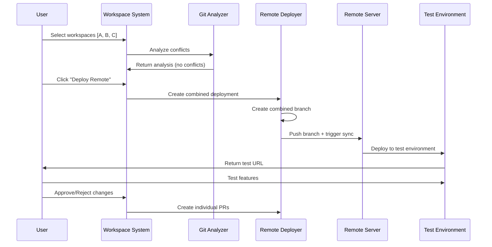
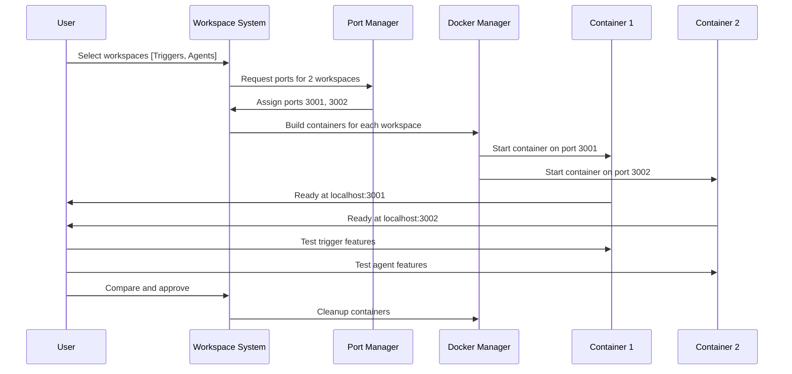

# Testing Strategy Implementation Guide
## 🎯 Overview
This document provides detailed implementation strategies for both remote deployment testing and local containerized testing scenarios, focusing on user workflows, automation, and conflict resolution.
## 🌐 Remote Deployment Testing Strategy
### Scenario: Production-Like Environment Testing
**Example**: Testing workspace changes on a live staging environment with full dependencies, databases, and services.
### Implementation Flow

### Configuration Example
```typescript
// Remote environment configuration
const remoteEnvironments: RemoteEnvironmentConfig = {
  "production-staging": {
    name: "Production Staging",
    description: "Full production environment with real data",
    // Git configuration
    git: {
      repository: "git@github.com:company/production-site.git",
      baseBranch: "main",
      branchPrefix: "workspace-test-",
      deployBranch: "staging"
    },
    // Deployment configuration
    deployment: {
      syncScript: "./scripts/workspace-sync.sh",
      deployScript: "./scripts/staging-deploy.sh",
      rollbackScript: "./scripts/rollback.sh",
      healthCheckUrl: "https://staging.company.com/health",
      testUrlPattern: "https://test-{branch}.staging.company.com"
    },
    // Environment variables
    environment: {
      NODE_ENV: "staging",
      DATABASE_URL: "postgres://staging-db.company.com/app",
      REDIS_URL: "redis://staging-redis.company.com",
      API_KEY: "${STAGING_API_KEY}"
    },
    // Notification configuration
    notifications: {
      webhookUrl: "https://api.company.com/webhooks/deployment",
      slackChannel: "#staging-deployments",
      emailList: ["dev-team@company.com"]
    }
  }
};
```
### Remote Sync Script Template
```bash
#!/bin/bash
# workspace-sync.sh - Deployed on remote server
set -e
# Input parameters
BRANCH_NAME=$1
WORKSPACE_IDS=$2
COMBINATION_ID=$3
# Configuration
REPO_DIR="/var/www/staging"
LOG_FILE="/var/log/workspace-deployments.log"
HEALTH_CHECK_URL="http://localhost:3000/health"
MAX_RETRIES=3
log() {
    echo "$(date '+%Y-%m-%d %H:%M:%S') [$COMBINATION_ID] $1" | tee -a $LOG_FILE
}
log "Starting deployment for branch: $BRANCH_NAME"
log "Workspaces: $WORKSPACE_IDS"
# Change to repository directory
cd $REPO_DIR
# Update repository
log "Fetching latest changes"
git fetch origin
# Checkout and pull branch
log "Checking out branch: $BRANCH_NAME"
git checkout $BRANCH_NAME
git pull origin $BRANCH_NAME
# Install dependencies
log "Installing dependencies"
npm ci --only=production
# Build application
log "Building application"
npm run build
# Stop current application
log "Stopping current application"
pm2 stop staging-app || true
# Start application
log "Starting new application"
pm2 start ecosystem.config.js --env staging --name staging-app
# Wait for application to start
sleep 30
# Health check with retries
log "Performing health check"
for i in $(seq 1 $MAX_RETRIES); do
    if curl -f $HEALTH_CHECK_URL; then
        log "Health check passed on attempt $i"
        break
    else
        log "Health check failed on attempt $i"
        if [ $i -eq $MAX_RETRIES ]; then
            log "Health check failed after $MAX_RETRIES attempts"
            # Rollback
            log "Rolling back to previous version"
            git checkout main
            npm ci --only=production
            npm run build
            pm2 restart staging-app
            # Notify failure
            curl -X POST "$WEBHOOK_URL/deployment/failed" \\
                -H "Content-Type: application/json" \\
                -d "{
                    \\"branch\\": \\"$BRANCH_NAME\\",
                    \\"combination_id\\": \\"$COMBINATION_ID\\",
                    \\"error\\": \\"Health check failed after deployment\\"
                }"
            exit 1
        fi
        sleep 10
    fi
done
# Generate test URL
TEST_URL="https://test-$(echo $BRANCH_NAME | sed 's/[^a-zA-Z0-9]/-/g').staging.company.com"
log "Deployment successful!"
log "Test URL: $TEST_URL"
# Notify success
curl -X POST "$WEBHOOK_URL/deployment/success" \\
    -H "Content-Type: application/json" \\
    -d "{
        \\"branch\\": \\"$BRANCH_NAME\\",
        \\"combination_id\\": \\"$COMBINATION_ID\\",
        \\"test_url\\": \\"$TEST_URL\\",
        \\"workspaces\\": \\"$WORKSPACE_IDS\\"
    }"
log "Deployment completed successfully"
```
### User Experience Flow
1. **Workspace Selection**
   ```typescript
   // User selects multiple workspaces
   const selectedWorkspaces = [
     { id: "ws-auth-fix", title: "Authentication Bug Fix" },
     { id: "ws-ui-update", title: "UI Polish Updates" },
     { id: "ws-perf-opt", title: "Performance Optimizations" }
   ];
   ```
2. **Conflict Analysis**
   ```typescript
   const conflictAnalysis = await analyzeConflicts(selectedWorkspaces);
   // Result: No conflicts detected, safe to proceed
   ```
3. **Remote Deployment**
   ```typescript
   const deployment = await deployToRemote(selectedWorkspaces, "production-staging");
   // Returns: { testUrl: "https://test-abc123.staging.company.com", deploymentId: "dep-456" }
   ```
4. **Testing & Feedback**
   ```typescript
   // User tests on remote URL, provides feedback
   const testResults = {
     workspaceResults: [
       { workspaceId: "ws-auth-fix", status: "pass", issues: [] },
       { workspaceId: "ws-ui-update", status: "pass", issues: [] },
       { workspaceId: "ws-perf-opt", status: "fail", issues: ["Performance regression detected"] }
     ]
   };
   ```
5. **PR Creation**
   ```typescript
   // Create PRs for successful workspaces only
   const prs = await createBatchPRs(
     selectedWorkspaces.filter(ws => testResults.workspaceResults
       .find(r => r.workspaceId === ws.id)?.status === "pass")
   );
   ```
## 🐳 Local Containerized Testing Strategy
### Scenario: Self-Contained Application Testing
**Example**: Testing multiple features of context-pipeline application on different ports locally.
### Implementation Flow

### Local Testing Configuration
```typescript
// Local testing configuration
const localTestingConfig: LocalTestingConfig = {
  basePort: 3001,
  maxConcurrentTests: 10,
  docker: {
    baseImage: "node:18-alpine",
    buildTimeout: 300000, // 5 minutes
    startTimeout: 60000,  // 1 minute
    healthCheckInterval: 5000
  },
  workspace: {
    buildScript: "npm run build",
    startScript: "npm run dev",
    healthCheckPath: "/api/health",
    environmentVariables: {
      NODE_ENV: "development",
      TEST_MODE: "true"
    }
  },
  cleanup: {
    autoCleanupAfter: 3600000, // 1 hour
    maxContainerAge: 7200000   // 2 hours
  }
};
```
### Docker Integration Implementation
```typescript
class LocalTestingManager {
  private portManager = new PortManager();
  private containerManager = new ContainerManager();
  private testTracker = new TestTracker();
  async startParallelTests(workspaces: Workspace[]): Promise<ParallelTestResult> {
    const results: LocalTestInstance[] = [];
    const failures: TestFailure[] = [];
    for (const workspace of workspaces) {
      try {
        const testInstance = await this.createTestInstance(workspace);
        results.push(testInstance);
      } catch (error) {
        failures.push({
          workspaceId: workspace.id,
          error: error.message,
          stage: 'creation'
        });
      }
    }
    return {
      successful: results,
      failed: failures,
      totalTests: results.length
    };
  }
  private async createTestInstance(workspace: Workspace): Promise<LocalTestInstance> {
    // 1. Assign port
    const port = this.portManager.assignPort(workspace.id);
    // 2. Create workspace branch locally
    const branchName = await this.createLocalBranch(workspace);
    // 3. Build Docker image
    const imageTag = await this.buildWorkspaceImage(workspace, branchName);
    // 4. Start container
    const container = await this.containerManager.startContainer({
      image: imageTag,
      port,
      environment: {
        WORKSPACE_ID: workspace.id,
        WORKSPACE_BRANCH: branchName,
        TEST_PORT: port.toString(),
        ...this.config.workspace.environmentVariables
      },
      labels: {
        'workspace.id': workspace.id,
        'workspace.type': 'local-test',
        'workspace.port': port.toString()
      }
    });
    // 5. Wait for container to be ready
    await this.waitForContainerReady(port, container.id);
    // 6. Create test instance
    const testInstance: LocalTestInstance = {
      id: generateId(),
      workspaceId: workspace.id,
      workspaceTitle: workspace.title,
      port,
      containerId: container.id,
      branchName,
      testUrl: `http://localhost:${port}`,
      status: 'running',
      startedAt: new Date(),
      logs: []
    };
    this.testTracker.addInstance(testInstance);
    return testInstance;
  }
  private async buildWorkspaceImage(workspace: Workspace, branchName: string): Promise<string> {
    const dockerfile = this.generateDockerfile(workspace);
    const imageTag = `workspace-test:${workspace.id}-${Date.now()}`;
    // Create temporary build context
    const buildContext = await this.createBuildContext(workspace, dockerfile);
    try {
      await this.containerManager.buildImage({
        context: buildContext,
        tag: imageTag,
        buildArgs: {
          WORKSPACE_BRANCH: branchName,
          WORKSPACE_ID: workspace.id
        }
      });
      return imageTag;
    } finally {
      await this.cleanupBuildContext(buildContext);
    }
  }
  private generateDockerfile(workspace: Workspace): string {
    return `
FROM node:18-alpine
# Set working directory
WORKDIR /app
# Install system dependencies if needed
RUN apk add --no-cache git
# Copy package files
COPY package*.json ./
# Install dependencies
RUN npm ci
# Copy source code
COPY . .
# Build the application
RUN npm run build
# Create non-root user
RUN addgroup -g 1001 -S nodejs
RUN adduser -S nextjs -u 1001
# Change ownership
RUN chown -R nextjs:nodejs /app
USER nextjs
# Expose port
EXPOSE 3000
# Health check
HEALTHCHECK --interval=30s --timeout=3s --start-period=5s --retries=3 \\
  CMD curl -f http://localhost:3000/api/health || exit 1
# Start the application
CMD ["npm", "run", "dev"]
`;
  }
}
```
### User Interface for Local Testing
```tsx
function LocalTestingDashboard({ workspaces }: { workspaces: Workspace[] }) {
  const [selectedWorkspaces, setSelectedWorkspaces] = useState<string[]>([]);
  const [activeTests, setActiveTests] = useState<LocalTestInstance[]>([]);
  const [testResults, setTestResults] = useState<Map<string, TestResult>>(new Map());
  const startParallelTests = async () => {
    const selected = workspaces.filter(w => selectedWorkspaces.includes(w.id));
    const results = await localTestingManager.startParallelTests(selected);
    setActiveTests(results.successful);
  };
  return (
    <div className="local-testing-dashboard">
      <div className="workspace-selector">
        <h3>Select Workspaces to Test</h3>
        <div className="grid grid-cols-2 md:grid-cols-3 gap-4">
          {workspaces.map(workspace => (
            <WorkspaceCard
              key={workspace.id}
              workspace={workspace}
              selected={selectedWorkspaces.includes(workspace.id)}
              onToggle={(id) => toggleWorkspaceSelection(id)}
            />
          ))}
        </div>
        <div className="actions">
          <button
            onClick={startParallelTests}
            disabled={selectedWorkspaces.length === 0}
            className="btn-primary"
          >
            🚀 Start Local Tests ({selectedWorkspaces.length} workspaces)
          </button>
        </div>
      </div>
      <div className="active-tests">
        <h3>Active Test Instances</h3>
        <div className="grid grid-cols-1 md:grid-cols-2 lg:grid-cols-3 gap-4">
          {activeTests.map(test => (
            <TestInstanceCard
              key={test.id}
              instance={test}
              result={testResults.get(test.workspaceId)}
              onTestComplete={(result) => handleTestComplete(test.workspaceId, result)}
            />
          ))}
        </div>
      </div>
    </div>
  );
}
function TestInstanceCard({ instance, result, onTestComplete }: TestInstanceCardProps) {
  const [feedback, setFeedback] = useState('');
  return (
    <div className="test-instance-card">
      <div className="header">
        <h4>{instance.workspaceTitle}</h4>
        <span className={`status ${instance.status}`}>{instance.status}</span>
      </div>
      <div className="test-info">
        <p><strong>Port:</strong> {instance.port}</p>
        <p><strong>Started:</strong> {formatTime(instance.startedAt)}</p>
      </div>
      <div className="test-actions">
        <a
          href={instance.testUrl}
          target="_blank"
          className="btn-secondary"
        >
          🖥️ Open Test Site
        </a>
        <div className="feedback">
          <textarea
            placeholder="Test feedback..."
            value={feedback}
            onChange={(e) => setFeedback(e.target.value)}
            className="feedback-input"
          />
          <div className="feedback-actions">
            <button
              onClick={() => onTestComplete({ status: 'pass', feedback })}
              className="btn-success"
            >
              ✅ Pass
            </button>
            <button
              onClick={() => onTestComplete({ status: 'fail', feedback })}
              className="btn-danger"
            >
              ❌ Fail
            </button>
          </div>
        </div>
      </div>
      {result && (
        <div className="test-result">
          <p><strong>Result:</strong> {result.status}</p>
          {result.feedback && <p><strong>Feedback:</strong> {result.feedback}</p>}
        </div>
      )}
    </div>
  );
}
```
## 🔄 Comparison & Decision Workflow
### Side-by-Side Testing Interface
```tsx
function WorkspaceComparisonView({ activeTests }: { activeTests: LocalTestInstance[] }) {
  const [selectedTests, setSelectedTests] = useState<string[]>([]);
  return (
    <div className="comparison-view">
      <div className="test-selector">
        <h3>Compare Test Instances</h3>
        <div className="test-checkboxes">
          {activeTests.map(test => (
            <label key={test.id} className="test-checkbox">
              <input
                type="checkbox"
                checked={selectedTests.includes(test.id)}
                onChange={(e) => toggleTestSelection(test.id, e.target.checked)}
              />
              {test.workspaceTitle} (Port {test.port})
            </label>
          ))}
        </div>
      </div>
      <div className="comparison-grid">
        {selectedTests.map(testId => {
          const test = activeTests.find(t => t.id === testId);
          return (
            <div key={testId} className="comparison-frame">
              <div className="frame-header">
                <h4>{test?.workspaceTitle}</h4>
                <a href={test?.testUrl} target="_blank" className="btn-link">
                  Open in New Tab
                </a>
              </div>
              <iframe
                src={test?.testUrl}
                className="test-frame"
                title={`Test: ${test?.workspaceTitle}`}
              />
            </div>
          );
        })}
      </div>
    </div>
  );
}
```
## 📊 Analytics & Reporting
### Testing Analytics Dashboard
```typescript
class TestingAnalytics {
  async generateTestingReport(combinationId: string): Promise<TestingReport> {
    const combination = await this.getCombination(combinationId);
    const workspaceResults = await this.getWorkspaceResults(combinationId);
    return {
      combinationId,
      summary: {
        totalWorkspaces: combination.workspaceIds.length,
        passedWorkspaces: workspaceResults.filter(r => r.status === 'pass').length,
        failedWorkspaces: workspaceResults.filter(r => r.status === 'fail').length,
        testDuration: this.calculateTestDuration(combination),
        testType: combination.testType
      },
      workspaceResults,
      performanceMetrics: await this.getPerformanceMetrics(combinationId),
      conflictAnalysis: combination.conflictAnalysis,
      recommendations: this.generateRecommendations(workspaceResults)
    };
  }
  private generateRecommendations(results: WorkspaceResult[]): Recommendation[] {
    const recommendations: Recommendation[] = [];
    // Identify successful combinations
    const successfulWorkspaces = results.filter(r => r.status === 'pass');
    if (successfulWorkspaces.length > 1) {
      recommendations.push({
        type: 'batch_pr',
        priority: 'high',
        description: `Create batch PRs for ${successfulWorkspaces.length} successful workspaces`,
        action: 'create_batch_prs',
        workspaceIds: successfulWorkspaces.map(r => r.workspaceId)
      });
    }
    // Identify failing workspaces that need iteration
    const failedWorkspaces = results.filter(r => r.status === 'fail');
    for (const failed of failedWorkspaces) {
      recommendations.push({
        type: 'iterate',
        priority: 'medium',
        description: `Address issues in ${failed.workspaceId}`,
        action: 'iterate_workspace',
        workspaceIds: [failed.workspaceId],
        issues: failed.issues
      });
    }
    return recommendations;
  }
}
```
## 🎯 Best Practices & Guidelines
### Remote Testing Best Practices
1. **Environment Isolation**
   - Use dedicated staging environments for workspace testing
   - Implement proper database seeding for consistent test data
   - Use feature flags to isolate experimental features
2. **Deployment Safety**
   - Always implement rollback mechanisms
   - Use health checks before marking deployment as successful
   - Monitor resource usage during testing
3. **Collaboration**
   - Notify team members when using shared staging environments
   - Provide clear test URLs and instructions
   - Document any environment-specific requirements
### Local Testing Best Practices
1. **Resource Management**
   - Implement automatic container cleanup
   - Monitor port usage to prevent conflicts
   - Set reasonable limits on concurrent tests
2. **Data Consistency**
   - Use consistent test data across all local instances
   - Implement data seeding scripts for each workspace
   - Consider using Docker volumes for shared test data
3. **Performance**
   - Optimize Docker images for faster startup times
   - Use layer caching to speed up builds
   - Implement parallel building when possible
This comprehensive testing strategy provides both technical implementation details and user experience flows for efficient parallel workspace development and testing.